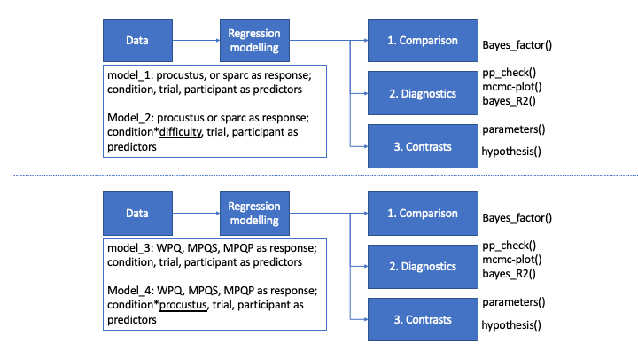
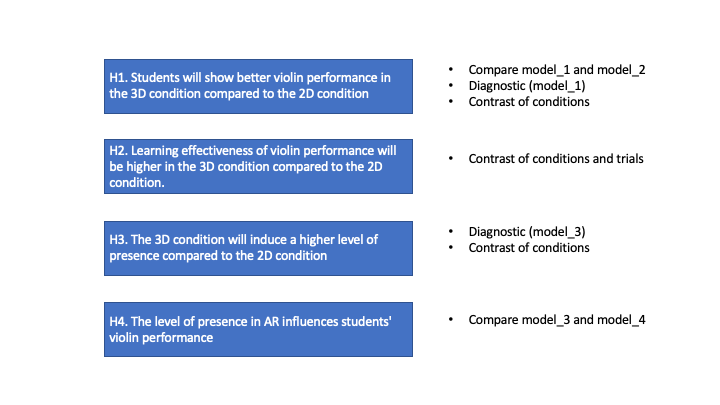
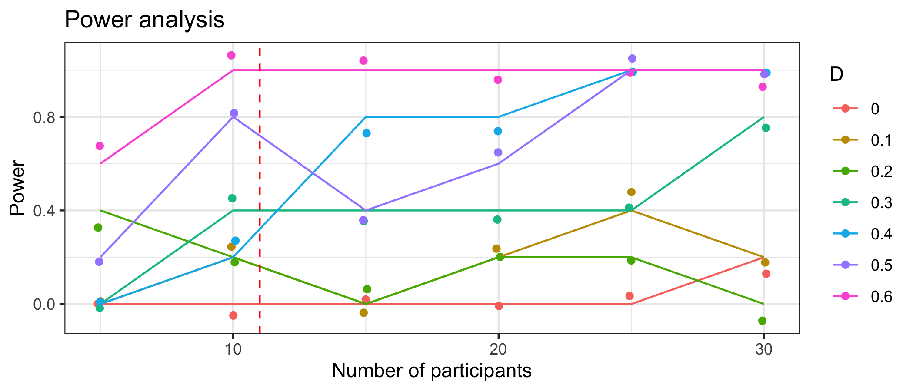

# Set up R environment

```{r setup, include=FALSE}
knitr::opts_chunk$set(echo = TRUE)
def.chunk.hook  <- knitr::knit_hooks$get("chunk")
knitr::knit_hooks$set(chunk = function(x, options) {
  x <- def.chunk.hook(x, options)
  ifelse(options$size != "normalsize", paste0("\n \\", options$size,"\n\n", x, "\n\n \\normalsize"), x)
})
```

# Introduction

The present document contains details about the data-analysis for the paper entitled: "The assessment of presence and performance in an AR environment for motor imitation learning: a case-study on violinists."
Authors: Adriaan Campo, Aleksandra Michałko, Bavo Van Kerrebroeck, Boris Stajic, Maja Pokric, Marc Leman.
Basically, the paper tests a violin playback system. The violinist's task is to play in synchrony with the principal violinist of an orchestra (represented as an avatar). The playback system provides the audio, in addition to a 2D or 3D avatar via a Hololens. The focus is mainly on the effect due to the experimental conditions of a 2D or 3D playback.

# Workflow

Figure 1 shows two statistical workflows. The upper workflow on top is about the biomechanical metrics from motion capture (here called: procustus and sparc, instead of PD and dSI as in the paper). Each metric represents differences between the violinist and the avatar, summarized over time. These values are used as response in regression models, whereas conditions, participants and trial are used as predictors. Model_1 and model_2 are similar models except that in model_2 `difficulty` is added in interaction with condition. The lower workflow is about the behavioral metrics of the questionnaires. We have 3 presence questionnaires. Model_3 and model_4 are similar models except that in model_4 `procustus` is added in interaction with condition.

In the upper workflow, we start with a comparison of model_1 and model_2 to test whether `difficulty` should be added to the model. We then perform a more detailed diagnostics of the best model, as well as a contrast analysis of condition and trials. In the lower workflow, we start with a comparison of model_3 and model_4 to test whether `procustus` should be added to the model. We then proceed with a more detailed diagnostics of the best model, as well as a contrast analysis of conditions. 
 


The workflows hold a scheme for testing the work hypothesis, as shown in figure 2: 

Hypothesis 1.	Students will show better violin performance in the 3D condition compared to the 2D condition:

- 1.1.	Similarity between virtual teachers’ and students' bow movement is higher .

- 1.2.	Movement smoothness is higher 

Hypothesis 2.	Learning effectiveness of violin performance will be higher in the 3D condition compared to the 2D condition.

Hypothesis 3.	The 3D condition will induce a higher level of presence compared to the 2D condition:

- 3.1.	"physical presence" will be higher

- 3.2.	"social presence" will be higher

Hypothesis 4.	The level of presence in AR influences students' violin performance.



In hypothesis 1, we first compare model_1 and model_2 and focus on the contrast analysis of the best model. This analysis will tell us the differences between conditions. In hypothesis 2, we expand our contrast analysis by comparing conditions and trials.
In hypothesis 3, we do a contrast analysis of model_3.  
In hypothesis 4 we test whether the procustus metric might be a relevant predictor variable.

# Power Analysis

A retrospective power analysis of the setup shown in Figure 3 reveals that 11 participants and 4 repeated measures has sufficient power when Cohen's D is > 0.6. To show that, we used a hierarchical statistical model with 2 conditions, and with participants and trials modeled as groups for which we assumed a standard deviation of 0.25 and 0.1, respectively. We tested Cohen's D from 0 to 0.6, and a number of participants from 5 to 30. For each dot in the graph below (e.g. D = 0.5, number of participants = 20) we simulated 500 models and tested whether the contrast of conditions has a probability mass of >= .95. The proportion of yes (versus no) is presented as power (in %). The results show that 11 participants have enough power (> 80%) when Cohen's D is > 0.6, meaning that there is <20% to miss an effect when there is in fact an effect (= false negative). In our models, we observe that the calibrated models have D > 0.8 (for the models: see below). 



# Data

The first box in the workflow shown in Figure 1 is about data. We use one dataset for all models.
The data variables are listed below:

```{r datasummary1, echo=TRUE}
load(file = "Data.RData")
str(Data)
```

```{r datasummary2, echo=TRUE}
head(Data)
```

```{r datasummary3, echo=TRUE}
summary(Data)
```

It is of interest to show the differences between non-calibrated and calibrated metrics, all obtained by taking the median of the data points (summarizing time).

```{r showmetrics1, echo=TRUE}
load(file = "Data.RData")
library(ggplot2)
library(patchwork)
p1 <- ggplot(Data) +
  geom_point(aes(x=participant,y=response0M_procustus, color = factor(condition)), position = position_jitterdodge()) +
  ggtitle("procustus")
p2 <- ggplot(Data) +
  geom_point(aes(x=participant,y=response1M_procustus, color = factor(condition)), position = position_jitterdodge()) +
  ggtitle("procustus-calibrated")
p3 <- ggplot(Data) +
  geom_point(aes(x=participant,y=response0M_sparc, color = factor(condition)), position = position_jitterdodge()) +
  ggtitle("sparc")
p4 <- ggplot(Data) +
  geom_point(aes(x=participant,y=response1M_sparc, color = factor(condition)), position = position_jitterdodge())+
  ggtitle("sparc-calibrated")
p1 / p2
p3 / p4

```

Here we show the answers to 3 presence questionnaires and 1 question about perceived difficulty.

```{r showmetrics2, echo=TRUE}
load(file = "Data.RData")
library(ggplot2)
library(patchwork)
p5 <- ggplot(Data) +
  geom_point(aes(x=participant,y=WPQ, color = factor(condition)), position = position_jitterdodge())+
  ggtitle("Witmer Presence questionnaire")
p6 <- ggplot(Data) +
  geom_point(aes(x=participant,y=MPQS, color = factor(condition)), position = position_jitterdodge())+
  ggtitle("social Makransky multimodal presence scale")
p7 <- ggplot(Data) +
  geom_point(aes(x=participant,y=MPQP, color = factor(condition)), position = position_jitterdodge())+
  ggtitle("physical Makransky multimodal presence scale")
p8 <- ggplot(Data) +
  geom_point(aes(x=participant,y=difficulty_s, color = factor(condition)), position = position_jitterdodge())+
  ggtitle("Perceived difficulty")
p5 / p6 
p7 / p8
```

The original data of the metrics procustus and sparc are time series.

# Regression modelling

The second box in the workflow of Figure 1 is about regression modelling.
We tested several models but we ended up with four basic models, model_1 and model_2 for the metric workflow, and model_3 and model_4 for the questionnaire workflow. The syntax of the models (here in R package `brms` format) is very similar.

* Model_1: response ~  0 + condition + (1 | condition:participant + condition:trial) )

* Model_2: response ~  0 + condition*difficulty + (1 + difficulty | condition:participant + condition:trial) )

* Model_3: response ~  0 + condition +  (1 | condition:participant + condition:trial) )

* Model_4: response ~  0 + condition*procustus + (1 + procustus | condition:participant + condition:trial) )

where:

- `response` is either the procustus of sparc metrics (giving us 2 different models for model_1), 

- `condition` is either a 2D or 3D rendering of the visual scene, 

- `difficulty` is the perceived difficulty of the task,

- `procustus` is the procustus metric of the task,

- `trial` is the participant's session.

In model_1 and model_2 a `skew_normal` link function is used, in model_3 and model_4 a `gaussian` link function is used. Note further that `participant` and `trial` are exchangeable variables. The advantage of the mixed model is that these variables can be modelled as instances of distributions at a higher hierarchical level. Accordingly, each participant, being exchangeable, is drawn from a normal distribution whose sd is estimated by the model. Same for trial. This modelling approach prevents overfitting by shrinking the instances of the group-level variables `participant` and `trial` towards the means of the respective group-level. Since `condition` has only two levels, we keep it as population variable. Group-level effects of `trial` are used later in a contrast analysis. Another way of looking at this regression is that it captures variability that is related to `participant` and `trial`, leaving a more "pure" variability of interest to `condition`.

We run the models on a 48 dual core machine (at Ghent University, IPEM), using the R package `brms`. 
We take 5000 warmups and 40000 iterations, with an adapt_delta = 0.995 and  max_treedepth = 12, 4 chains, and 24 threads. The large amount of iterations was needed in view of a stable Bayes factor test in the R package `parameters`.

# Analysis

We then proceed with the analysis in 3 parts (Figure 1).

- 1. Comparison. We do a comparison of two models (model_1 = without `difficulty`, model_2 = with `difficulty`) using the Bayes-factor test (using `bayes_factor()`). Running ahead, we found that none of the model_2 turn are any better than model_1. 

- 2. Diagnostics. We use `pp_check()` for a global retrodiction check and `mcmc_plot()` for an overview of the posterior distributions of parameters, we also run a `bayes_R2()` to get an estimate of the variances, and `parameters()` in order to get a summary of the model.

- 3. Contrasts. We code trials as factors. Alternatively, we could have chosen a longitudinal approach coding trial as `integer` (rather than factor) but we thought that a factor approach was more appropriate given the fact that order was relevant, instead of the exact time between the sessions.
We report contrast testing both as table and as plot. 

# PART 1 

Part 1 of this analysis is related to the procustus and sparc metrics and hypothesis 1 and 2.

# 1. Comparison

We tested the models for procustus and sparc and report here the log of the Bayes factor.

# Bayes-factor non-calibrated models

```{r Bayes-factor0M, echo=TRUE}
load(file = "Results/BF_model_comparison_procustus0M.RData")
load(file = "Results/BF_model_comparison_sparc0M.RData")
print(paste("Bayes factor in favor of model_1 over model_2 (procutus0M): ", BF_model_comparison_procustus0M$bf ))
print(paste("Bayes factor in favor of model_1 over model_2 (sparc0M): ", BF_model_comparison_sparc0M$bf ))

```

# Bayes-factor calibrated models

```{r Bayes-factor1M, echo=TRUE, message=TRUE}
load(file = "Results/BF_model_comparison_procustus1M.RData")
load(file = "Results/BF_model_comparison_sparc1M.RData")
print(paste("Bayes factor in favor of model_1 over model_2 (procustus1M): ", BF_model_comparison_procustus1M$bf ))
print(paste("Bayes factor in favor of model_1 over model_2 (sparc1M): ", BF_model_comparison_sparc1M$bf ))
```

We conclude that there is strong evidence for model_1 (i.e., without `difficulty`).

# 2. Diagnostics

We show the diagnostics both for the procustus and sparc model_1:

- the model_1 formula, 

- the Bayes_R2 analysis, 

- the model parameters,

- the posterior prediction check (pp_check) next to the plot of fixed parameters (i.e. `condition`)

# Diagnostics for non-calibrated models

```{r Diagnostiics0M, echo=TRUE}
load(file = "Results/post_analysis_procustus0M.RData")
load(file = "Results/post_analysis_sparc0M.RData")
post_analysis_procustus0M
post_analysis_sparc0M
```

# Diagnostics for calibrated models

```{r Diagnostiics1M, echo=TRUE}
load(file = "Results/post_analysis_procustus1M.RData")
load(file = "Results/post_analysis_sparc1M.RData")
post_analysis_procustus1M
post_analysis_sparc1M
```


# 3. Contrasts

We show the contrasts both for the procustus model_1 and the sparc model_1.
See the paper for a discussion about the contrast results.
The `Label` is coded as follows: c stands for condition, c12 for a contrast of condition 1 and condition 2.
t stands for trial, t12 stands for a contrast of trial 1 and trial 2.
Accordingly, c1t12 stands for a contrast of trial 1 an trial 2 in condition 1.
c12t1 stands for a contrast of trial 1 in condiition 1 versus condition 2.

# Contrasts for non-calibrated models

```{r Contrasts0M, echo=TRUE}
load(file = "Results/hypothesis_test_procustus0M.RData")
load(file = "Results/hypothesis_test_sparc0M.RData")

hypothesis_test_procustus0M[[1]][,1]
hypothesis_test_procustus0M[[1]][,-1]
hypothesis_test_procustus0M[[2]]

hypothesis_test_sparc0M[[1]][,1]
hypothesis_test_sparc0M[[1]][,-1]
hypothesis_test_sparc0M[[2]]
```

# Contrasts for calibrated models

```{r Contrasts1M, echo=TRUE}
load(file = "Results/hypothesis_test_procustus1M.RData")
load(file = "Results/hypothesis_test_sparc1M.RData")

hypothesis_test_procustus1M[[1]][,1]
hypothesis_test_procustus1M[[1]][,-1]
hypothesis_test_procustus1M[[2]]

hypothesis_test_sparc1M[[1]][,1]
hypothesis_test_sparc1M[[1]][,-1]
hypothesis_test_sparc1M[[2]]
```

# Added view on trial distributions

In Figure 5 and 6 we show the trial distributions drawn from the calibrated model for the procustus and sparc metrics. 
The graphs below are based on the calibrated models from which we took the group-level effects of `trial` and build their posterior distributions. In this approach, as known, estimates are typically shrinked towards the mean, assuring robust modelling. Alternatively, we could have modelled a longitudinal model using time (weeks or days) as temporal variable. However, in this context, we believe that order was more relevant than time and therefore we coded trial as a factor rather than a numeric variable.


# PART 2 

Part 2 of this analysis is related to questionnaire models and hypothesis 3 and 4, following the workflow of Figure 1 (bottom part).

# 1. Comparison

We tested the models for the 4 questions and report here the log of the Bayes factor.

# non-calibrated

```{r Bayes-factorQ, echo=TRUE}
load(file = "Results/BF_model_comparison_WPQ_0M.RData")
load(file = "Results/BF_model_comparison_MPQS_0M.RData")
load(file = "Results/BF_model_comparison_MPQP_0M.RData")
load(file = "Results/BF_model_comparison_Difficulty_0M.RData")
print(paste("Bayes factor in favor of model_3 over model_4 (WPQ_0M): ", BF_model_comparison_WPQ_0M ))
print(paste("Bayes factor in favor of model_3 over model_4 (MPQS_0M): ", BF_model_comparison_MPQS_0M ))
print(paste("Bayes factor in favor of model_3 over model_4 (MPQP_0M): ", BF_model_comparison_MPQP_0M ))
print(paste("Bayes factor in favor of model_3 over model_4 (Difficulty_OM): ", BF_model_comparison_Difficulty_0M ))
```

# calibrated

```{r Bayes-factorcali, echo=TRUE}
load(file = "Results/BF_model_comparison_WPQ_1M.RData")
load(file = "Results/BF_model_comparison_MPQS_1M.RData")
load(file = "Results/BF_model_comparison_MPQP_1M.RData")
load(file = "Results/BF_model_comparison_Difficulty_1M.RData")
print(paste("Bayes factor in favor of model_3 over model_4 (WPQ_1M): ", BF_model_comparison_WPQ_1M ))
print(paste("Bayes factor in favor of model_3 over model_4 (MPQS_1M): ", BF_model_comparison_MPQS_1M ))
print(paste("Bayes factor in favor of model_3 over model_4 (MPQP_1M): ", BF_model_comparison_MPQP_1M ))
print(paste("Bayes factor in favor of model_3 over model_4 (Difficulty_1M): ", BF_model_comparison_Difficulty_1M ))
```

From this analysis it can be concluded that there is moderate evidence for model_3 for presence, and anecdotical evidence for model_3 for difficulty. Basically, it means that `procustus` does not contribute to an explanation of those responses.

# 2. Diagnostics

We show the diagnostics both for the 4 question models:

- the model_1 formula, 

- the Bayes_R2 analysis, 

- the model parameters,

- the posterior prediction check (pp_check) next to the plot of fixed parameters (i.e. `condition`)

Given the fact that `procustus` has no substantial influence we use model_1 (without `procustus`)

```{r DiagnosticsQ, echo=TRUE}
load(file = "Results/post_analysis_procustus_basicWPQ.RData")
load(file = "Results/post_analysis_procustus_basicMPQS.RData")
load(file = "Results/post_analysis_procustus_basicMPQP.RData")
load(file = "Results/post_analysis_procustus_basicDifficulty.RData")

post_analysis_procustus_basicWPQ
post_analysis_procustus_basicMPQS
post_analysis_procustus_basicMPQP
post_analysis_procustus_basicDifficulty
```

# 3. Contrasts

```{r ContrastsQuestionnaires, echo=TRUE}
load(file = "Results/Contrast_WPQ.RData")
load(file = "Results/Contrast_MPQS.RData")
load(file = "Results/Contrast_MPQP.RData")
load(file = "Results/Contrast_Difficulty.RData")

Contrasts_Questionnaires <- rbind(
Contrast_WPQ[[1]][-1],
Contrast_MPQS[[1]][-1],
Contrast_WPQP[[1]][-1],
Contrast_Difficulty[[1]][-1] 
)
rownames(Contrasts_Questionnaires) <- NULL

Contrasts_Questionnaires
```
